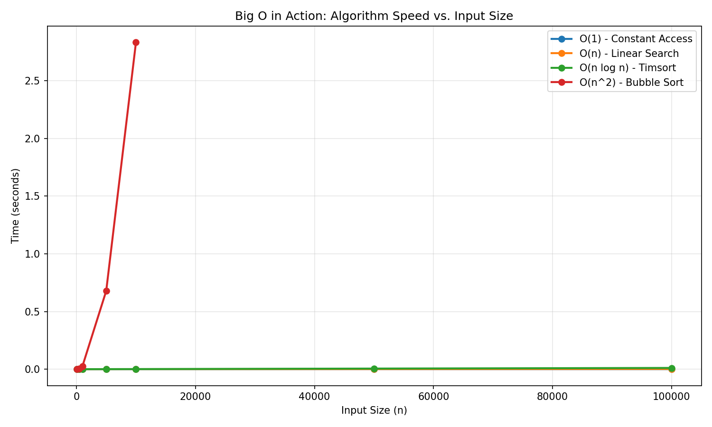
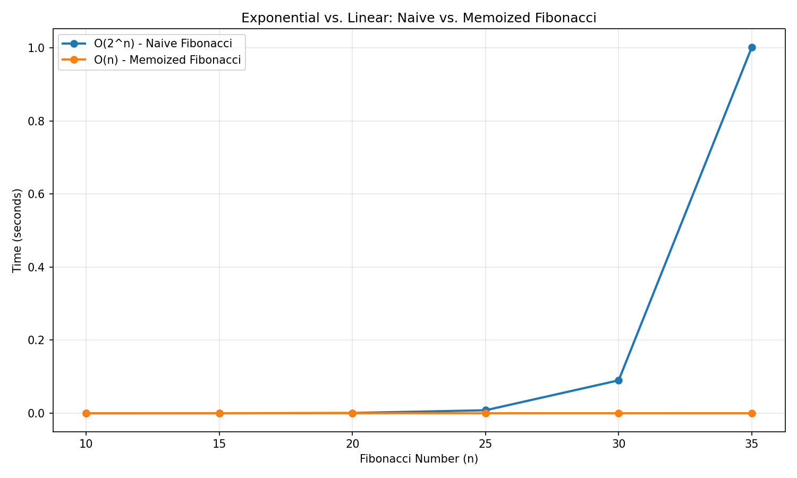

# Visualize Big O: Algorithm Speed Tester

This project demonstrates how different algorithms perform as data size increases. By comparing actual execution times, you'll see firsthand why algorithm complexity matters.

NextWork Documentation: [Visualize Big O: Algorithm Speed Tester](https://learn.nextwork.org/zealous_orange_zesty_pummelo/docs/4272a8b8-aa17-4794-9aed-efcdb666dde9)

## What's Inside

### Core Modules

- **algorithms.py** - Collection of algorithms with different time complexities:
  - `constant_access()` - O(1) constant time
  - `linear_search()` - O(n) linear time
  - `sort_data()` - O(n log n) using Timsort
  - `bubble_sort()` - O(n²) quadratic time
  - `fib_naive()` - O(2ⁿ) exponential time
  - `fib_memoized()` - O(n) optimized with memoization

- **benchmark.py** - Benchmarking framework:
  - `run_benchmarks()` - Tests algorithms on input sizes from 100 to 100,000
  - `run_fib_benchmarks()` - Compares naive vs. memoized Fibonacci
  - Uses `time.perf_counter()` for accurate measurements

- **visualize.py** - Generates visualization charts:
  - `create_chart()` - Plots algorithm growth curves
  - `create_fib_chart()` - Visualizes exponential vs. linear growth

### Visualizations

- **big_o_comparison.png** - Shows growth curves for all algorithms
- **fib_comparison.png** - Demonstrates the impact of memoization on Fibonacci





## Setup

### Prerequisites
- Python 3.7+
- Virtual environment (recommended)

### Installation

```bash
# Clone the repository
git clone https://github.com/shafiswapnil/big-o-lab.git
cd big-o-lab

# Create virtual environment
python3 -m venv venv
source venv/bin/activate  # On Windows: venv\Scripts\activate

# Install dependencies
pip install -r requirements.txt
```

## Usage

### Run Benchmarks
```bash
python benchmark.py
```
Outputs a detailed table showing execution times for each algorithm across different input sizes.

### Generate Visualizations
```bash
python visualize.py
```
Creates `big_o_comparison.png` and `fib_comparison.png` charts.

## Key Insights

- **O(1)** - Constant time, no change regardless of input size
- **O(n)** - Linear growth, time increases proportionally with input
- **O(n log n)** - Efficient sorting, scales well even for large datasets
- **O(n²)** - Quadratic growth, becomes impractical for large inputs
- **O(2ⁿ)** - Exponential growth, practically unusable beyond small values
- **Memoization** - Can reduce exponential to linear time by caching results

## Requirements

- matplotlib
- numpy (optional, for advanced numerical operations)

See `requirements.txt` for exact versions.

## License

This project is open source and available for educational purposes.

---

**Author:** shafiswapnil  
**Created:** June 12, 2026